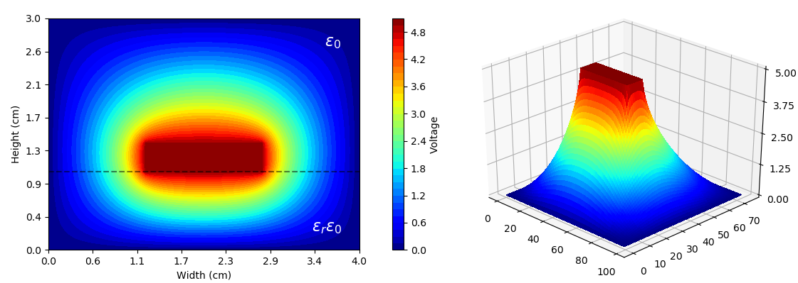

# Microstrip FDM
Program for approximating the steady-state voltage distribution inside a microstrip using a finite difference method (FDM). The sides of the microstrip are at ground potential and the conducting strip at the center is excited with a voltage of V<sub>0</sub>. The approximation is made under the assumption that the microstrip is long enough in the z-direction that we can ignore any fringing fields.

Additional functions are provided to estimate the capacitance per unit length, and to display the voltage distribution in 3D or as contour plot.

<br/>
<p align="center"></p>


## Usage
You will need the following python libraries:

* matplotlib
* numpy
* scipy

They can be installed separately via `pip`, or you can install one of the many [scientific python distributions](https://www.scipy.org/install.html) available that already include these packages.

### Running The Program

```bash
python microstrip.py
```

### Changing Microstrip Properties
The dimensions of the microstrip are stored in the dictionary called `DIMS`. Although the center conductor is most commonly centered horizontally, you can specify an offset by changing the value of 'x' (e.g. `'x': 2` will place the conducting strip 2 units from the left side of the microstrip).

```python
DIMS = {
    'units': 'cm',
    'W': 4,
    'H': 3,
    'h': 1,
    'w': 1.5,
    't': 0.4,
    'x': None
}
```

The other parameters can be specified when you create a new Microstrip object.

```python
M1 = Microstrip(V_0=5, eps_r=1, max_res=0.0001, **DIMS)
```


## Outputs
<br/>
<p align="center"></p>